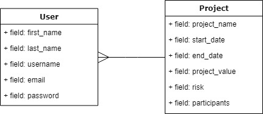

## Modelagem do banco



## Este projeto foi feito com:

* [Python 3.9.7](https://www.python.org/)
* [Django 3.2.8](https://www.djangoproject.com/)
* [Bootstrap 4.0](https://getbootstrap.com/)

## Download & Instruções para instalação:

* Clone esse repositório.
* Crie um virtualenv com Python 3.
* Ative o virtualenv.
* Instale as dependências.
* Rode as migrações.

**Ativar virtualenv no Linux**
* source .venv/bin/activate

**Ativar virtualenv no Windows**
* venv\scripts\activate

```
git clone https://github.com/JonathaCnB/project-manager.git
cd project-manager
python3 -m venv venv
source .venv/bin/activate
pip install -r requirements.txt
python manage.py migrate
python manage.py createsuperuser --username="admin" --email=""
```

## Tasklist

- [X] Implementar modelo de user personalizado
- [X] Criar models conforme modelagem
- [ ] CRUD Usuários
- [ ] CRUD Projetos
- [ ] Template de cálculo

