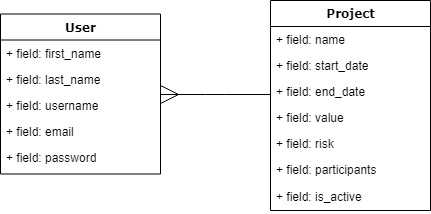

## Deploy 
Projeto está em produção no seguinte endereço: 'https://gestor-de-projetos.herokuapp.com/'
* [Deployed](https://gestor-de-projetos.herokuapp.com/)

## Modelagem do banco



## Este projeto foi feito com:

* [Python 3.9.7](https://www.python.org/)
* [Django 3.2.8](https://www.djangoproject.com/)
* [Bootstrap 4.0](https://getbootstrap.com/)

## Download & Instruções para instalação:

* Clone esse repositório.
* Crie um virtualenv com Python 3.
* Ative o virtualenv.
* Instale as dependências.
* Rode as migrações.

**Ativar virtualenv no Linux**
* source .venv/bin/activate

**Ativar virtualenv no Windows**
* venv\scripts\activate

```
git clone https://github.com/JonathaCnB/project-manager.git
cd project-manager
python3 -m venv venv
source .venv/bin/activate
pip install -r requirements-dev.txt
python manage.py migrate
python manage.py createsuperuser --username="admin" --email=""
```

## Tasklist

- [X] Implementar modelo de user personalizado
- [X] Criar models conforme modelagem
- [X] CRUD Usuários
- [X] CRUD Projetos
- [X] Template de cálculo

## Informações gerais
* Apenas usuários logados podem acessar a área de projetos.
* Para cadastrar basta acessar o menu cadastro no canto superior.
* Após o cadastro será redirecionando para página de gerenciamento dos projetos.
* Também há possibilidade de efetuar login, acessando o botão Entrar.
* Os projetos porem ser facilmente cadastrados, adicionei algumas validações:\
* A data de término não pode ser inferior da data de início e o projeto não pode ter um valor negativo.
* Para simular um projeto basta clicar na coluna 'Nome do projeto'.
* Enquanto o valor do investimento for menor que o valor do projeto uma mensagem em velho\
* ficará na tela.
* Caso o valor seja maior e retornado o valor do investimento conforme calculo informado.
* Na coluna 'Ações o projeto' pode ser editado ou excluído.
